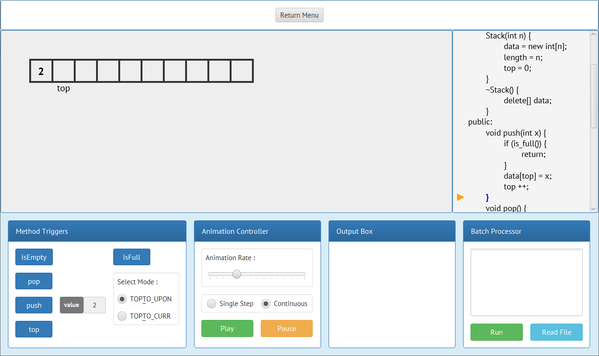

English | [简体中文](./README.cn.md)

# DataStructureVisualizer

*Authored by JM233333*

*Notice: The current source code is only a DEMO version, and some basic functions are still flawed. For example, the application cannot yet respond well to the user's illegal input.*

## Introduction

### Overview

**DataStructureVisualizer** is a PC desktop application that provides visualization and interaction of algorithms and data structures, and supports programmers (even newbies) to simply extend it.

*For convenience of description, we will abbreviate the data structure (or algorithm) visualized by the application as **VDS**.*

### Features

With this visualization tool, you can:

- See the visual elements of the logical structure of VDS;

- See an animation of the algorithm execution process and data structure maintenance process;

- See code traces of performed VDS operations synchronized with the animation;

- See the output of various operations of the VDS.

And you can also interact with the VDS, for example:

- Let the VDS perform the operation specified by the user;

- Set animation parameters, such as adjusting the animation playback rate and setting whether to play in a single step;

- Control the detail-level of the output, such as requiring all intermediate DEBUG information to be output or only the final result.

What's more, the programmers can add user-defined VDS by themselves.

Importantly, They don't need to read and understand the source code of the application. They just need to consult the developer manual provided by us. The only condition is that the programmers should has at least a basic understanding of Java syntax, and they need to follow some preset rules while extending.

However, the extension is limited. At present, the tool only supports VDSs based on one or more of the following logical structures:

- Linear List (including Sequential List and Linked List);

- Binary Tree.

Obviously supporting only the above is insufficient, so I plan to add support for the following logical structures in future versions:

- Two-dimensional nested Linear List (including Sequential List and Linked List, cross-nesting supported);

- K-ary Tree;

- Graph (simple structure only).

## Installation

### Option 1 : Download the pre-compiled jar package or exe file

In order to help those who have no experience with Java to get started quickly, I prepared pre-compiled jar package and exe file, which can be downloaded from the following URL. However, these may not be the latest version.

[(Download_address_has_not_been_set)](blog.jm233333.com)

For any PC user, you can directly download the compressed package containing the jar package, decompress it, and run the `.jar` file directly to launch the application. However, you must download and configure JRE 8+ to run the `.jar` file.

If you are a Windows user, you can also directly download the compressed package containing the exe file, decompress it, and run the `.exe` file directly to launch the application. In this way, you don't need to configure the JRE because it has been packaged into this exe file.

*Notice:*

- *JRE 8 or higher version is required for jar package. If using JRE 10+, you may need to manually add JavaFX modules to your JRE.*

- *The exe file must be run in Windows but requires no additional environment configuration.*

### Option 2 : Download and compile the source code

If you have experience with Java, you can clone or download the source code from the project's GitHub page, and then build the project using Ant or any IDE (such as Ecllipse, IDEA, etc.).

The easiest way is to compile directly with Ant, but you must first download and configure JDK 8+ and Apache Ant 1.10.x, and set the environment variable `JAVA_HOME` to the root directory of JDK. After completing the configuration, go to the root directory of the source code folder, open the CLI, and run the following command:

```
ant all
```

If the build is successful, you will see the prompt `BUILD SUCCESSFUL` in the command line, and you can find the following in `out/artifacts/` :

```
custom/
lib/
DataStructureVisualizer.jar
```

Run the `.jar` file directly to launch the application.

*Notice:*

- *JDK 8 or higher version is required. If using JDK 10+, you may need to manually add JavaFX modules to your JDK.*

- *If you build the project with Ant, then 1.10.x is required.*

## Quick Start

Run the application and start the visualization, you will see the following GUI:



The **Menu** at the top of the GUI is used to switch the VDS or return to the main menu.

- *Note: The current version only supports returning to the main menu. The other feature is planned to be implemented in a future version.*

The **Controller** below the GUI is the main UI for users to interact with the application, which includes 4 sub-modules:

- **Method Triggers** are used to control the VDS. You can use the method trigger to let the data structure perform certain specified operations, such as letting the stack execute `push 2`.

- **Animation Controller** includes all controls for setting animation related parameters, such as playing and pausing animation, adjusting animation playback rate, and setting whether to play the animation single-step or not.

- **Output Box** is used to receive the output stream from the VDS during the execution of the operations, and decide which content to output according to the detail-level of the output set by the user.

- **Batch Processor** Supports execution of complex operation flows. You can enter a sequence of operations in the text box, or read a preset sequence of operations from the specified file and batch process the operations.

The **Monitor** in the center of the GUI is responsible for viusalizing the VDS. All visual elements used to display the VDS, and their animation effects, are displayed by the monitor. Actually, the monitor is similar to an artboard.

The **Code Tracker** on the right side of the GUI is responsible for displaying the actual implementation code of the VDS, and is responsible for code tracking while performing operations.

For more detailed usage, please refer to the tutorial document in the pre-compiled product package or source code directory.

## Defects of the Current Version

### Planned Features

；

### Known BUGs

Until 2020.3.23, I have not found any bug in the latest released version.

- *Because I have not released the application yet \^\_\^*

## More

；

## Change Log

| Date       | Updates |
| :---       | :--- |
| 2019.12.1  | Starts developing this project. |
|            | Early update records are omitted for brevity. |
| 2020.3.5   | Most basic features are implemented. |
| 2020.3.17  | Adds support for compilation with Ant. |
| 2020.3.23  | Finishes writing the README. |
| 2020.3.27  | Fix BUG : Localization of VisualBST. |
|            | Fix BUG : Animation mistake of batch-processing. |
| 2020.3.28  | Fix BUG : Animation mistake of VisualPointer. |
|            | Adds the todo list into the README. |

## Todo List

Things planned to do in the near future:

- Update : Adds support for single-step animation of VisualizedList.

- Update : Implements methods {get(index)} and {find(value)} for VisualizedList.

- Update : Implements methods of VisualizedBST.

- Update : Adds support for single-step animation of VisualizedBST.